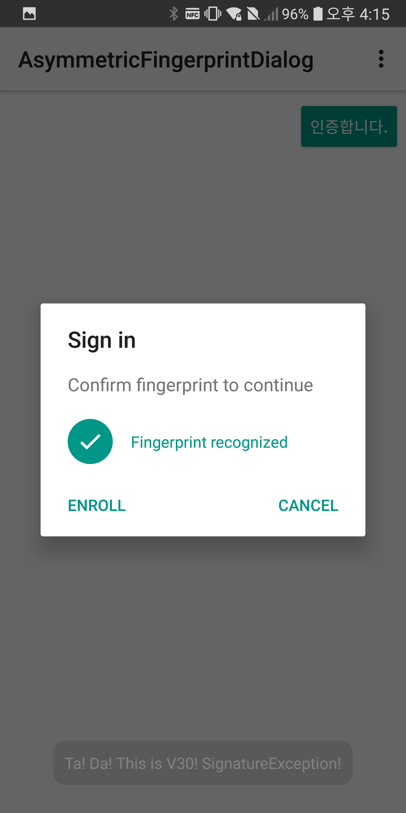
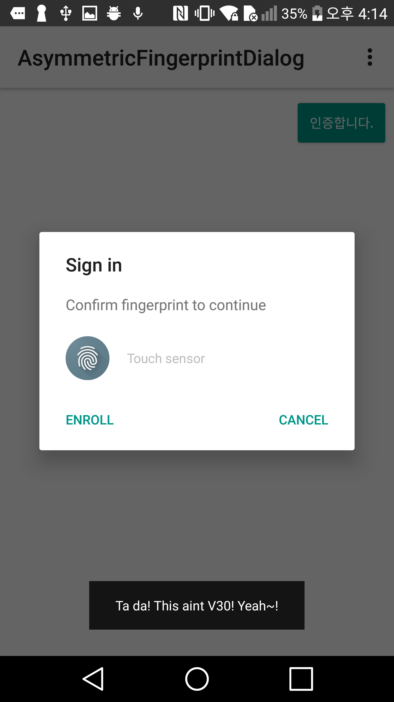
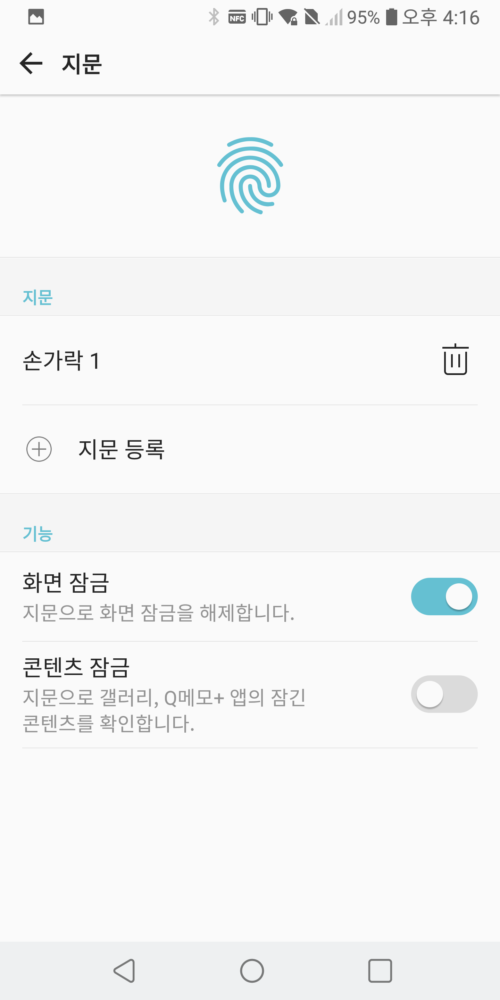

# V30 지문 버그 재현용 앱

구글의 AsymmetricFingerPrintDialog 앱을 변형하여 V30(오레오) 버전의 지문 버그를 재현합니다.

## 재현방법

1. 앱을 실행 후 상단의 `인증합니다` 버튼을 누른다.
2. Sign in 다이얼로그가 뜨면 `Enroll` 버튼을 눌러 등록한다. (앱을 끄지 말라.)
3. 지문을 사용하여 인증이 적용되는 것을 확인한다.
4. 앱을 끄지 않은 채 설정 화면에 가서 지문을 모두 지우고 새로운 지문을 등록한다.
5. `인증합니다` 버튼을 눌러 다시 진행한다.
6. 화면 하단에 발생하는 토스트를 확인한다.

V30을 제외한 다른 단말에서는 InvalidKeyException가 지문 인증전에 발생하여 이 예외를 기준으로 지문 재 등록으로 진행할 수 있다
반면 V30(오레오) 버전에서는 verify 과정에서 SignatureException 예외를 얻게된다. SignatureException은 일시적으로도
발생할 수 있는 예외이기 때문에 이를 근거로 지문 재 등록으로 진입시키기는 어렵다.

### V30 토스트

### 그외 토스트

### 지문 설정 화면

## 이 문제가 해결된 후 예상 결과

V30 단말에서도 InvalidKeyException이 발생하도록 수정되어야 한다. 수정이 되면 V30이 아니다라는 토스트가 뜨게 될 것이다.
